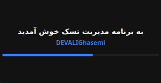
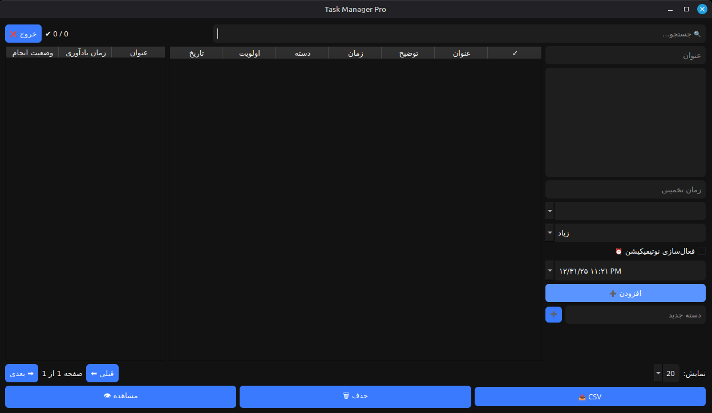

# 📝 Task Manager Pro
### Persian (Farsi) Desktop Application

A professional **Task Management Desktop Application** developed using **Python & PySide6 (Qt)** with a modern UI and full **Persian (RTL)** support.

> 🇮🇷 This application is fully **Persian (Farsi)** and designed specifically for Persian-speaking users.

---

## 🚀 Key Features

- ➕ Add, edit, delete, and view tasks
- 👁 Dedicated task preview dialog
- ✅ Mark tasks as completed / uncompleted
- 🗂 Category management system
- ⭐ Priority levels (High / Medium / Low) with color indicators
- 🔍 Smart search (title, description, category)
- 📊 Task statistics (completed vs total)
- 📄 Pagination (20 / 50 items per page)
- 📤 Export all tasks to CSV
- 🌙 Modern dark theme UI
- ⏳ Splash screen with loading animation
- 💾 SQLite local database
- 🔁 Real-time UI updates
- ⏰ **Task reminder with scheduled notifications (NEW)** 🔔

---

## 🆕 New Update – Task Reminder & Notification System

> 🔔 **New Feature Added!**

Task Manager Pro now supports **task scheduling with notifications**, so you never forget important tasks.

### ⏰ Task Reminder Features

- 🕒 Set **date & time** for each task  
- 🔔 Automatic **desktop notification** at the scheduled time  
- ⏱ Background timer checks reminders in real-time  
- 🔁 Notifications work while the app is running  
- 📌 Ideal for deadlines, meetings, and daily reminders  

> 🇮🇷 All reminder texts and notifications are fully **Persian (Farsi)**.

---

## 🖥️ Screenshots

### Splash Screen


### Main Application


---

## 🛠️ Technologies & Tools

| Technology | Usage |
|----------|------|
| Python 3 | Core language |
| PySide6 | Desktop UI (Qt) |
| SQLite | Local database |
| Qt Widgets | UI Components |
| RTL Layout | Persian language support |
| QTimer | Reminder & notification system |

---

## 📦 Installation & Run

### 1️⃣ Clone the repository
```bash
git clone https://github.com/DevALIGhasemi/task-manager-pro.git
cd task-manager-pro
```

### 2️⃣ Install dependencies
```bash
pip install PySide6
```

### 3️⃣ Run the application
```bash
python Taskmanager.py
```
